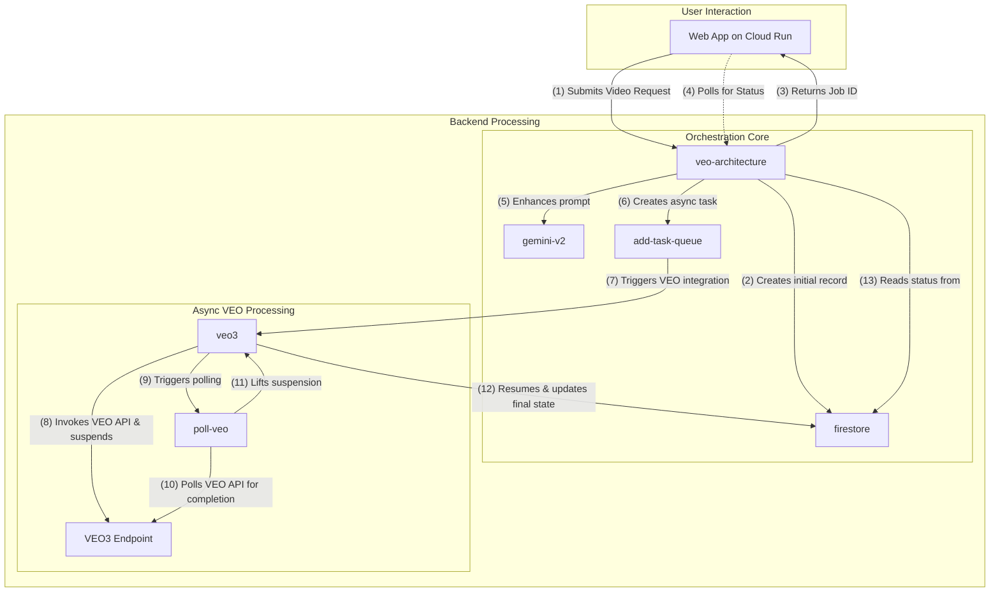

# VEO Video Processing and Analysis Pipeline

This project implements a sophisticated, event-driven video processing and analysis pipeline on Google Cloud. It leverages Google Cloud's Application Integration to orchestrate a series of serverless components, including Cloud Run, Cloud Tasks, Firestore, and the Vertex AI Gemini API for advanced video intelligence.

## 🌟 Overview

The application allows users to upload videos through a web interface. Once a video is uploaded, it triggers a complex backend workflow orchestrated by Application Integration. This workflow processes the video, extracts insights using the VEO and Gemini models, and stores the state and results in Firestore.

The entire infrastructure and application deployment process is automated with a single, robust shell script.

## 🏗️ Architecture

The architecture is designed to be scalable, resilient, and fully serverless, handling a synchronous initial request and a long-running asynchronous processing workflow.



1.  **Initial Request**: The **Web App** submits a new video processing request to the main **veo-architecture** integration.
2.  **Create Initial Record**: The **veo-architecture** integration immediately creates a unique job ID (UUID) and saves a record to **Firestore** with an initial status (e.g., "incomplete").
3.  **Immediate Response**: The integration returns the new job ID to the **Web App**.
4.  **Periodic Polling**: The **Web App** now uses this ID to periodically poll the main integration for status updates.
5.  **Prompt Enhancement**: Asynchronously, the main integration proceeds by calling the **gemini-v2** integration to refine the prompt.
6.  **Create Async Task**: It then calls the **add-task-queue** integration to place the job in a Cloud Tasks queue for rate-limiting and decoupling.
7.  **Trigger VEO Integration**: A task from the queue triggers the **veo3** integration.
8.  **Invoke & Suspend**: The **veo3** integration calls the external **VEO3 Endpoint** to start the video analysis and then immediately suspends its own execution.
9.  **Trigger Polling**: Upon suspension, **veo3** triggers the **poll-veo** integration.
10. **Check for Completion**: The **poll-veo** integration repeatedly polls the **VEO3 Endpoint** until the analysis is complete.
11. **Lift Suspension**: Once the job is finished, **poll-veo** lifts the suspension on the waiting **veo3** integration.
12. **Persist Final State**: The now-resumed **veo3** integration takes the final results and updates the job's record directly in **Firestore**.
13. **Return Status**: When the Web App polls for status, the main **veo-architecture** integration reads the latest state for the given job ID from **Firestore** and returns it.

## ⚙️ Prerequisites

Before you begin, ensure you have the following installed and configured:

1.  **Google Cloud SDK**: [Install the gcloud CLI](https://cloud.google.com/sdk/docs/install).
2.  **Application Integration CLI (`integrationcli`)**: [Installation Instructions](https://github.com/GoogleCloudPlatform/application-integration-management-toolkit).
3.  **A Google Cloud Project**: You must have a GCP project with an active billing account.

### 🔑 Required Permissions

The user running the deployment script needs sufficient permissions on the target Google Cloud project. For simplicity, the **Owner** role (`roles/owner`) is recommended, as the script will be granting broad permissions to other service accounts.

The script simplifies permissions by using the project's **Default Compute Engine service account** for all operations. To ensure this works, the script will automatically grant the following roles to this service account:

- `Editor` (`roles/editor`)
- `Service Account Token Creator` (`roles/iam.serviceAccountTokenCreator`)

It also grants the `Cloud Run Service Agent` role to the project's **Cloud Build service account** to allow source-based deployments.

## 🚀 Deployment

The entire deployment is automated via a single script.

### 1. Clone the Repository

```bash
git clone <your-repo-url>
cd demo-appint-veo3
```

### 2. Configure Your Environment

The script relies on an `env.sh` file for its configuration.

1.  **Create the file**:
    ```bash
    cp env.sh.example env.sh
    ```
2.  **Edit `env.sh`**: Open the `env.sh` file and replace all placeholder values (`<your-...>`) with your specific GCP project details.

    | Variable           | Description                                           | Example                          |
    | :----------------- | :---------------------------------------------------- | :------------------------------- |
    | `PROJECT_ID`       | Your Google Cloud Project ID.                         | `my-gcp-project-123`             |
    | `REGION`           | The GCP region for deployment.                        | `us-central1`                    |
    | `SERVICE_NAME`     | The name for the Cloud Run service.                   | `veo-app`                        |
    | `QUEUE_NAME`       | The name for the Cloud Tasks queue.                   | `veo-queue`                      |
    | `STATE_COLLECTION` | The name of the Firestore collection.                 | `video-processing-state`         |
    | `STATE_DB`         | The name of the Firestore database.                   | `(default)`                      |
    | `GCS_BUCKET_URI`   | The globally unique URI for the Cloud Storage bucket. | `gs://my-unique-veo-bucket-1234` |

### 3. Run the Deployment Script

Make the script executable and run it:

```bash
chmod +x deploy_all.sh
./deploy_all.sh
```

The script will guide you through the deployment process. It will perform the following actions:

- Validate your environment variables.
- Force gcloud re-authentication for security.
- Enable all required GCP APIs.
- **Pause and prompt you to perform a one-time manual setup for Application Integration in the Cloud Console.** This is a critical step.
- Create and configure a service account with the necessary IAM roles.
- Create the Firestore database, Cloud Tasks queue, and GCS bucket if they don't exist.
- Substitute placeholder values in all Application Integration configuration files.
- Deploy all Application Integration assets (`gemini-v2`, `veo3`, etc.).
- Prompt you to optionally deploy the Python web application to Cloud Run.

### 4. Access Your Application

If you chose to deploy the web application, the script will output the URL of the Cloud Run service at the end of the deployment process. You can open this URL in your browser to start using the application.

## 🧹 Cleanup

To remove all the resources created by the `deploy_all.sh` script, you can use the `cleanup.sh` script. This script will guide you through deleting all the created GCP resources, asking for confirmation before each step.

```bash
./cleanup.sh
```

> **Note**: The script does not delete the Firestore data. You must manually delete the collection from the Google Cloud Console.

## Scripts

This project contains the following scripts:

- `deploy_all.sh`: The main script to deploy the entire stack (infrastructure, integrations, and optionally the web app).
- `cleanup.sh`: Reverses the deployment, deleting all created resources to avoid incurring further costs.
- `src/deploy.sh`: A standalone script to deploy _only_ the Python web application. This is useful for iterating on the frontend without re-deploying the entire backend.

## License

All solutions within this repository are provided under the
[Apache 2.0](https://www.apache.org/licenses/LICENSE-2.0) license.
Please see the [LICENSE](./LICENSE.txt) file for more detailed terms and conditions.

## Not Google Product Clause

This is not an officially supported Google product, nor is it part of an
official Google product.
