# VEO Video Processing and Analysis Pipeline

This project implements a sophisticated, event-driven video processing and analysis pipeline on Google Cloud. It leverages Google Cloud's Application Integration to orchestrate a series of serverless components, including Cloud Run, Cloud Tasks, Firestore, and the Vertex AI Gemini API for advanced video intelligence.

## 🌟 Overview

The application allows users to upload videos through a web interface. Once a video is uploaded, it triggers a complex backend workflow orchestrated by Application Integration. This workflow processes the video, extracts insights using the VEO and Gemini models, and stores the state and results in Firestore.

The entire infrastructure and application deployment process is automated with a single, robust shell script.

## 🏗️ Architecture

The architecture is designed to be scalable, resilient, and fully serverless.

```mermaid
graph TD
    subgraph User Interaction
        A[🌐 Web App on Cloud Run] -->|1. Upload Video| B(Cloud Storage);
    end

    subgraph Backend Orchestration
        B -->|2. Trigger| C{VEO Architecture Integration};
        C -->|3. Create Task| D[📨 Cloud Tasks Queue];
        C -->|4. Persist State| E[🗂️ Firestore Database];

        D -->|5. Execute| F(VEO & Gemini Models);
        F -->|6. Poll for Results| G(Poll VEO Integration);
        G -->|7. Update State| E;
    end

    A -->|Displays Status| E;
```



1.  **Web App (Cloud Run)**: A Python Flask application provides the user interface for uploading videos and viewing results.
2.  **Cloud Storage**: Acts as the trigger and repository for raw video files.
3.  **Application Integration**: The core orchestrator. A series of integrations (`veo-architecture`, `gemini-v2`, `veo3`, etc.) manage the entire workflow, from task creation to state management.
4.  **Cloud Tasks**: Manages the asynchronous execution of long-running video processing jobs.
5.  **Firestore**: A NoSQL database used to store the state of each video processing job and the final results.
6.  **Vertex AI (VEO/Gemini)**: The AI models used for video understanding and analysis.

## ⚙️ Prerequisites

Before you begin, ensure you have the following installed and configured:

1.  **Google Cloud SDK**: [Install the gcloud CLI](https://cloud.google.com/sdk/docs/install).
2.  **Application Integration CLI (`integrationcli`)**: [Installation Instructions](https://github.com/GoogleCloudPlatform/application-integration-management-toolkit).
3.  **A Google Cloud Project**: You must have a GCP project with an active billing account.

### 🔑 Required Permissions

The user or service account running the deployment script needs sufficient permissions on the target Google Cloud project. For simplicity, the **Owner** role (`roles/owner`) is recommended.

Alternatively, a custom role with the following permissions is required:

- `roles/resourcemanager.projectIamAdmin`
- `roles/serviceusage.serviceUsageAdmin`
- `roles/appintegration.admin`
- `roles/storage.admin`
- `roles/aiplatform.admin`
- `roles/cloudtasks.admin`
- `roles/run.admin`
- `roles/iam.serviceAccountAdmin`
- `roles/iam.serviceAccountUser`
- `roles/firestore.admin`

## 🚀 Deployment

The entire deployment is automated via a single script.

### 1. Clone the Repository

```bash
git clone <your-repo-url>
cd demo-appint-veo3
```

### 2. Configure Your Environment

The script relies on an `env.sh` file for all its configuration.

1.  **Create the file**:
    ```bash
    cp env.sh.example env.sh
    ```
2.  **Edit `env.sh`**: Open the `env.sh` file and replace all placeholder values (`<your-...>`) with your specific GCP project details.

    | Variable           | Description                                 | Example                                             |
    | :----------------- | :------------------------------------------ | :-------------------------------------------------- |
    | `PROJECT_ID`       | Your Google Cloud Project ID.               | `my-gcp-project-123`                                |
    | `REGION`           | The GCP region for deployment.              | `us-central1`                                       |
    | `SERVICE_NAME`     | The name for the Cloud Run service.         | `veo-app`                                           |
    | `SERVICE_ACCOUNT`  | The email of the service account to create. | `veo-sa@my-gcp-project-123.iam.gserviceaccount.com` |
    | `QUEUE_NAME`       | The name for the Cloud Tasks queue.         | `veo-queue`                                         |
    | `STATE_COLLECTION` | The name of the Firestore collection.       | `video-processing-state`                            |
    | `STATE_DB`         | The name of the Firestore database.         | `(default)`                                         |

### 3. Run the Deployment Script

Make the script executable and run it:

```bash
./deploy_all.sh
```

The script will perform the following actions:

- Validate your environment variables.
- Force gcloud re-authentication for security.
- Enable all required GCP APIs.
- Create and configure a service account with the necessary IAM roles.
- Create the Firestore database and Cloud Tasks queue if they don't exist.
- Substitute placeholder values in all Application Integration configuration files.
- Deploy all Application Integration assets (`gemini-v2`, `veo3`, etc.).
- Prompt you to optionally deploy the Python web application to Cloud Run.

### 4. Access Your Application

If you chose to deploy the web application, the script will output the URL of the Cloud Run service at the end of the deployment process. You can open this URL in your browser to start using the application.

## Scripts

This project contains two deployment scripts:

- `deploy_all.sh`: The main script to deploy the entire stack (infrastructure, integrations, and optionally the web app).
- `src/deploy.sh`: A standalone script to deploy _only_ the Python web application. This is useful for iterating on the frontend without re-deploying the entire backend.
